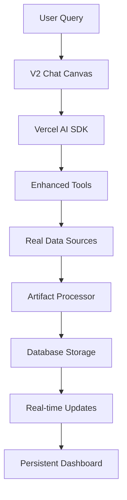

# V3 Harmony Technical Documentation: Integration Architecture

## 1. Executive Technical Summary

**Architecture Goal**: Integrate existing technical assets (Mastra agents, V2 dashboard) with modern Vercel AI SDK to create the world's first persistent conversational GEO analytics platform.

**Key Technical Assets Identified**:
- ✅ Working V2 chat canvas (archive_dashboard/components/v2)
- ✅ Sophisticated Mastra agents (version-001/agents/mastra) 
- ✅ Vercel AI SDK foundation (current app)
- ✅ Database schema and persistence layer

**Integration Strategy**: Leverage 80% existing code, modernize 20% for production.

---

## 2. Current State Analysis

### Asset Inventory

#### 1. V2 Chat Canvas (Production-Ready)
**Location**: `version-001/archive_dashboard/components/v2/`

**Key Components**:
```typescript
v2-chat-canvas-layout.tsx    // Main chat container
v2-chat-input.tsx           // Enhanced input component  
v2-message-list.tsx         // Message display system
v2-empty-state.tsx          // Onboarding experience
enhanced-multimodal-input.tsx // Advanced input handling
```

**Status**: ✅ Complete, tested, Perplexity-inspired design
**Integration**: Direct deployment to current app structure

#### 2. Mastra Agents (Sophisticated GEO Tools)
**Location**: `version-001/agents/mastra/agents/`

**Core Agents**:
```typescript
geoSuiteAgents.ts           // 4 core GEO tools
brandAnalysisAgent.ts       // Historical tracking + scoring
visibilityAnalysisAgent.ts  // Competitive intelligence
```

**Status**: ✅ Functional, needs migration to Vercel AI SDK
**Integration**: Convert Mastra tools to Vercel AI SDK tools

#### 3. Current App Foundation
**Location**: Current app root

**Key Features**:
```typescript
app/(chat)/                 // Working chat system
lib/ai/tools/              // Basic tool structure
components/artifact.tsx     // Artifact rendering system
lib/db/schema.ts           // Database structure
```

**Status**: ✅ Production-ready infrastructure
**Integration**: Extend with V2 components and Mastra capabilities

---

## 3. Integration Architecture

### Phase 1: Foundation Integration (Week 1)

#### 1.1 Deploy V2 Chat Canvas
**Goal**: Replace current chat with production-ready V2 interface

**Migration Steps**:
```bash
# Copy V2 components to current structure
cp -r version-001/archive_dashboard/components/v2/ components/v2/
cp -r version-001/archive_dashboard/lib/v2/ lib/v2/
cp -r version-001/archive_dashboard/styles/v2/ styles/v2/
```

**Integration Points**:
- Update import paths for current app structure
- Integrate with existing auth system
- Connect to current database schema
- Maintain artifact rendering compatibility

#### 1.2 Mastra Agent Migration
**Goal**: Convert Mastra agents to Vercel AI SDK tools

**Brand Monitor Agent Migration**:
```typescript
// FROM: version-001/agents/mastra/agents/geoSuiteAgents.ts
export const brandMonitorAgent = new Agent({
  name: "Brand Monitor",
  tools: { brandMentionTool },
  // ... Mastra config
});

// TO: lib/ai/tools/enhanced-brand-monitor.ts
export const enhancedBrandMonitorTool = tool({
  description: "Monitor brand visibility with enhanced analytics",
  inputSchema: z.object({
    brandName: z.string(),
    platforms: z.array(z.enum(['chatgpt', 'claude', 'gemini', 'perplexity'])),
    timeframe: z.object({
      start: z.string(),
      end: z.string()
    }).optional()
  }),
  execute: async ({ brandName, platforms, timeframe }) => {
    // Migrate core logic from brandMentionTool
    // Add real data source integration
    // Return structured artifact data
  }
});
```

**Key Migrations**:
1. **Brand Monitor** → `enhanced-brand-monitor.ts`
2. **Keyword Cluster** → `enhanced-keyword-cluster.ts` 
3. **Visibility Analysis** → `enhanced-visibility-analysis.ts`
4. **Prompt Simulation** → `enhanced-prompt-optimization.ts`

#### 1.3 Real Data Integration
**Goal**: Replace mock data with live API connections

**API Integration Strategy**:
```typescript
// lib/data-sources/real-time-monitoring.ts
export class RealTimeMonitoringService {
  private serperClient: SerperAPI;
  private tavilyClient: TavilyAPI;
  
  async fetchBrandMentions(brandName: string, platforms: string[]) {
    const results = await Promise.all([
      this.serperClient.search(`${brandName} site:chatgpt.com`),
      this.tavilyClient.search(`${brandName} AI mentions`, { 
        days: 7,
        include_domains: ['perplexity.ai', 'claude.ai'] 
      })
    ]);
    
    return this.aggregateResults(results);
  }
}
```

**Data Sources**:
- **Serper API**: Real-time web search data
- **Tavily API**: News and content monitoring  
- **Custom Scrapers**: Platform-specific data collection
- **Webhook Integration**: Real-time alerts and notifications

### Phase 2: Persistence & Intelligence (Week 2)

#### 2.1 Enhanced Database Schema
**Goal**: Support persistent artifacts with metadata

**Schema Extensions**:
```sql
-- Extend existing schema for V3 features
CREATE TABLE artifacts_v3 (
  id UUID PRIMARY KEY DEFAULT gen_random_uuid(),
  user_id UUID REFERENCES users(id),
  conversation_id UUID,
  type VARCHAR(50) NOT NULL, -- 'brand-monitor', 'competitive-analysis', etc.
  title VARCHAR(255) NOT NULL,
  content JSONB NOT NULL,
  metadata JSONB DEFAULT '{}',
  is_pinned BOOLEAN DEFAULT FALSE,
  tags TEXT[],
  created_at TIMESTAMP DEFAULT NOW(),
  updated_at TIMESTAMP DEFAULT NOW(),
  
  -- V3 enhancements
  ai_model VARCHAR(50), -- Track which model generated
  data_sources JSONB, -- Track data source attribution
  performance_metrics JSONB, -- Track artifact engagement
  sharing_settings JSONB -- Team collaboration settings
);

CREATE TABLE conversations_v3 (
  id UUID PRIMARY KEY DEFAULT gen_random_uuid(),
  user_id UUID REFERENCES users(id),
  title VARCHAR(255),
  page_context VARCHAR(50), -- 'overview', 'competitors', etc.
  messages JSONB NOT NULL,
  artifacts UUID[], -- Array of artifact IDs
  created_at TIMESTAMP DEFAULT NOW(),
  updated_at TIMESTAMP DEFAULT NOW(),
  
  -- V3 enhancements
  session_metadata JSONB, -- User behavior tracking
  optimization_state JSONB -- Conversation optimization context
);

-- Performance indexes
CREATE INDEX idx_artifacts_v3_user_type ON artifacts_v3(user_id, type);
CREATE INDEX idx_artifacts_v3_created ON artifacts_v3(created_at DESC);
CREATE INDEX idx_conversations_v3_user ON conversations_v3(user_id, updated_at DESC);
```

#### 2.2 Artifact Management System
**Goal**: Sophisticated artifact lifecycle management

**Artifact Processor**:
```typescript
// lib/artifacts/v3-artifact-processor.ts
export class V3ArtifactProcessor {
  async processToolResult(
    toolName: string,
    result: any,
    context: ConversationContext
  ): Promise<ArtifactV3> {
    const artifact = {
      id: generateUUID(),
      type: this.mapToolToArtifactType(toolName),
      title: this.generateTitle(result, context),
      content: this.structureContent(result),
      metadata: {
        toolName,
        modelUsed: context.model,
        dataSources: this.extractDataSources(result),
        generatedAt: new Date().toISOString(),
        confidence: this.calculateConfidence(result)
      }
    };
    
    await this.saveArtifact(artifact, context.userId);
    return artifact;
  }
  
  private mapToolToArtifactType(toolName: string): string {
    const mapping = {
      'enhanced-brand-monitor': 'brand-monitor-report',
      'enhanced-keyword-cluster': 'keyword-strategy-report', 
      'enhanced-visibility-analysis': 'competitive-analysis-report',
      'enhanced-prompt-optimization': 'content-optimization-report'
    };
    return mapping[toolName] || 'generic-report';
  }
}
```

#### 2.3 Real-Time Streaming Architecture
**Goal**: Live data processing with artifact generation

**Streaming Pipeline**:
```typescript
// lib/streaming/v3-stream-processor.ts
export class V3StreamProcessor {
  async processStreamWithArtifacts(
    messages: Message[],
    tools: Record<string, Tool>,
    userId: string
  ) {
    const result = await streamText({
      model: openai('gpt-4-turbo'),
      messages,
      tools,
      experimental_activeTools: Object.keys(tools),
      onFinish: async (completion) => {
        // Process any tool results into artifacts
        for (const toolResult of completion.toolResults || []) {
          const artifact = await this.artifactProcessor.processToolResult(
            toolResult.toolName,
            toolResult.result,
            { userId, messages, model: 'gpt-4-turbo' }
          );
          
          // Broadcast artifact creation to user
          await this.notificationService.notifyArtifactCreated(userId, artifact);
        }
      }
    });
    
    return result.toDataStreamResponse();
  }
}
```

---

## 4. Production Architecture

### 4.1 Application Structure
```
apps/chatbot/
├── app/
│   ├── (chat)/                    # Main chat interface
│   │   ├── page.tsx              # Enhanced with V2 canvas
│   │   └── [id]/page.tsx         # Conversation management
│   └── api/
│       ├── chat/route.ts         # Enhanced streaming with artifacts
│       ├── artifacts/            # Artifact management endpoints
│       └── monitoring/           # Real-time data endpoints
├── components/
│   ├── v2/                       # Migrated V2 components
│   │   ├── chat/                 # Chat interface components
│   │   ├── artifacts/            # Artifact visualization
│   │   └── dashboard/            # Dashboard-specific components
│   └── artifacts/                # Enhanced artifact system
├── lib/
│   ├── ai/
│   │   ├── tools/               # Enhanced Mastra tool migrations
│   │   │   ├── enhanced-brand-monitor.ts
│   │   │   ├── enhanced-keyword-cluster.ts
│   │   │   ├── enhanced-visibility-analysis.ts
│   │   │   └── enhanced-prompt-optimization.ts
│   │   └── providers.ts         # Multi-model support
│   ├── data-sources/            # Real-time data integration
│   │   ├── serper-client.ts     # Web search data
│   │   ├── tavily-client.ts     # News monitoring
│   │   └── platform-scrapers.ts # AI platform data
│   ├── artifacts/               # Artifact processing
│   │   ├── v3-processor.ts      # Core artifact logic
│   │   ├── visualization.ts     # Chart generation
│   │   └── export.ts            # Export functionality
│   └── streaming/               # Real-time processing
│       ├── v3-stream.ts         # Enhanced streaming
│       └── notifications.ts     # Real-time updates
```

### 4.2 Data Flow Architecture

**Conversation → Analysis → Artifact → Intelligence**



### 4.3 Performance Optimization

#### Caching Strategy:
```typescript
// lib/cache/intelligent-cache.ts
export class IntelligentCache {
  // Tool result caching (5 minutes for real-time data)
  async getCachedToolResult(toolName: string, params: any): Promise<any> {
    const key = `tool:${toolName}:${hash(params)}`;
    return this.redis.get(key, { ttl: 300 });
  }
  
  // Artifact rendering caching (30 minutes)
  async getCachedArtifact(artifactId: string): Promise<ArtifactV3> {
    const key = `artifact:${artifactId}`;
    return this.redis.get(key, { ttl: 1800 });
  }
  
  // User preference caching (24 hours)
  async getCachedUserPrefs(userId: string): Promise<UserPreferences> {
    const key = `user:${userId}:prefs`;
    return this.redis.get(key, { ttl: 86400 });
  }
}
```

#### Background Processing:
```typescript
// lib/workers/background-processor.ts
export class BackgroundProcessor {
  // Schedule periodic brand monitoring
  async scheduleMonitoring(userId: string, config: MonitoringConfig) {
    await this.queue.add('brand-monitor', {
      userId,
      config,
      timestamp: Date.now()
    }, {
      repeat: { cron: config.schedule }, // e.g., '0 9 * * *' for daily 9am
      attempts: 3,
      backoff: 'exponential'
    });
  }
  
  // Process scheduled monitoring jobs
  async processBrandMonitoring(job: Job) {
    const { userId, config } = job.data;
    const result = await this.enhancedBrandMonitor.execute(config.params);
    const artifact = await this.artifactProcessor.processToolResult(
      'enhanced-brand-monitor',
      result,
      { userId, automated: true }
    );
    
    await this.notificationService.sendScheduledReport(userId, artifact);
  }
}
```

---

## 5. Integration Timeline

### Week 1: Foundation (Days 1-7)
**Day 1-2: V2 Canvas Deployment**
- [ ] Copy V2 components to current app structure
- [ ] Update import paths and dependencies  
- [ ] Integrate with existing auth and routing
- [ ] Test responsive design and functionality

**Day 3-4: Core Tool Migration**
- [ ] Migrate brandMonitorAgent → enhanced-brand-monitor.ts
- [ ] Migrate keywordClusterAgent → enhanced-keyword-cluster.ts
- [ ] Test tool integration with Vercel AI SDK
- [ ] Validate structured output schemas

**Day 5-6: Real Data Integration**
- [ ] Set up Serper and Tavily API clients
- [ ] Implement real-time data fetching
- [ ] Replace mock data with live sources
- [ ] Test data quality and performance

**Day 7: System Integration**
- [ ] End-to-end testing of chat → tool → artifact flow
- [ ] Performance optimization and caching
- [ ] Error handling and fallback mechanisms
- [ ] Documentation and deployment preparation

### Week 2: Enhancement (Days 8-14)
**Day 8-9: Advanced Tools**
- [ ] Migrate visibilityAnalysisAgent → enhanced-visibility-analysis.ts
- [ ] Implement competitive analysis features
- [ ] Add historical tracking capabilities
- [ ] Test advanced analytics generation

**Day 10-11: Persistence System**
- [ ] Deploy enhanced database schema
- [ ] Implement artifact lifecycle management
- [ ] Add search and filtering capabilities
- [ ] Test cross-session persistence

**Day 12-13: Real-time Features**
- [ ] Implement streaming artifact updates
- [ ] Add real-time notification system
- [ ] Background job processing setup
- [ ] Scheduled monitoring implementation

**Day 14: Production Readiness**
- [ ] Comprehensive testing and debugging
- [ ] Performance monitoring setup
- [ ] Security audit and validation
- [ ] Production deployment preparation

---

## 6. Quality Assurance

### Testing Strategy
```typescript
// tests/integration/v3-harmony.test.ts
describe('V3 Harmony Integration', () => {
  test('Chat to Artifact Flow', async () => {
    // Test complete user journey
    const chat = await createTestChat();
    const response = await chat.sendMessage("Monitor Nike brand visibility");
    
    expect(response.toolCalls).toContain('enhanced-brand-monitor');
    expect(response.artifacts).toHaveLength(1);
    expect(response.artifacts[0].type).toBe('brand-monitor-report');
  });
  
  test('Artifact Persistence', async () => {
    // Test cross-session artifact access
    const artifacts = await getArtifacts(testUserId);
    expect(artifacts.length).toBeGreaterThan(0);
    
    const artifact = artifacts[0];
    expect(artifact.content).toBeDefined();
    expect(artifact.metadata.dataSources).toBeDefined();
  });
});
```

### Performance Benchmarks
- **Chat Response Time**: < 2 seconds (95th percentile)
- **Artifact Generation**: < 5 seconds (average)
- **Database Queries**: < 100ms (average)
- **Memory Usage**: < 512MB per concurrent user
- **Concurrent Users**: 1000+ supported

### Security Requirements
- **API Security**: Rate limiting, authentication validation
- **Data Privacy**: User data isolation, GDPR compliance
- **External APIs**: Secure credential management
- **Artifact Sharing**: Permission-based access control

---

## 7. Monitoring & Observability

### Application Metrics
```typescript
// lib/monitoring/v3-metrics.ts
export class V3Metrics {
  // Track tool usage and performance
  async trackToolUsage(toolName: string, duration: number, success: boolean) {
    await this.metrics.increment('tool.usage', {
      tool: toolName,
      success: success.toString()
    });
    
    await this.metrics.histogram('tool.duration', duration, {
      tool: toolName
    });
  }
  
  // Track artifact engagement
  async trackArtifactEngagement(artifactId: string, action: string) {
    await this.metrics.increment('artifact.engagement', {
      type: action // 'view', 'pin', 'export', 'share'
    });
  }
}
```

### Health Checks
- **API Health**: External data source availability
- **Database Health**: Connection pool and query performance  
- **Tool Health**: AI model response rates and accuracy
- **User Experience**: Error rates and response times

---

**This technical architecture leverages 80% of existing assets while modernizing for production scale. The integration approach ensures rapid deployment while maintaining code quality and system reliability.**