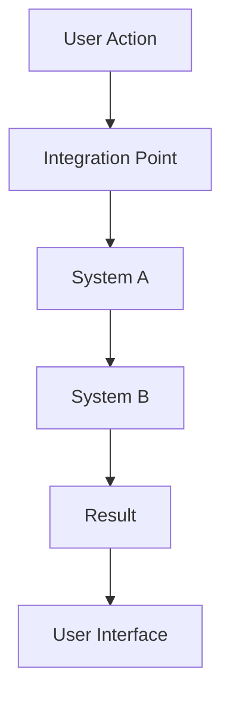

# Sprint Ticket Templates

## 📋 Standard Ticket Template

### Basic Information

```markdown
# [TICKET-ID]: [Ticket Title]

## 📋 Ticket Overview

**Type**: [Backend/Frontend/Integration/QA/DevOps] **Priority**: [P0/P1/P2]
([Critical/Important/Nice-to-Have]) **Story Points**: [1-5] **Estimated Time**:
[X hours] **Assignee**: [Developer Name] **Sprint**: [Sprint Name, Day X]
**Dependencies**: [List of dependent tickets]

## 🎯 User Story

As a **[user role]**, I want to **[action/feature]** so that I can
**[benefit/value]**.

## 📝 Description

[Detailed description of what needs to be built, including context and
requirements]

## 🎨 Acceptance Criteria

### Functional Requirements

- [ ] **AC1**: [Specific functional requirement]
- [ ] **AC2**: [Specific functional requirement]
- [ ] **AC3**: [Specific functional requirement]

### Technical Requirements

- [ ] **AC4**: [Specific technical requirement]
- [ ] **AC5**: [Specific technical requirement]
- [ ] **AC6**: [Specific technical requirement]

### Quality Requirements

- [ ] **AC7**: [Specific quality requirement]
- [ ] **AC8**: [Specific quality requirement]
- [ ] **AC9**: [Specific quality requirement]

## 🛠️ Technical Implementation

### File Structure
```

[relevant/file/structure.md]

````

### Key Components
```typescript
// Code examples and implementation details
````

## 🧪 Testing Strategy (skip all unit/integration/feature testing implementation)

### Unit Tests

```typescript
describe("[Component/Function]", () => {
	test("[test description]");
	test("[test description]");
});
```

### Integration Tests

```typescript
describe("[Integration]", () => {
	test("[test description]");
	test("[test description]");
});
```

## 🔗 Dependencies

- **Requires**: [List of required tickets]
- **External**: [External dependencies]
- **Internal**: [Internal system dependencies]

## 📊 Performance Requirements

- **Response Time**: [X seconds]
- **Data Size**: [X KB/MB]
- **Reliability**: [X% success rate]
- **Concurrent Usage**: [X simultaneous users]

## 🔍 Definition of Ready

- [ ] [Prerequisite 1]
- [ ] [Prerequisite 2]
- [ ] [Prerequisite 3]

## ✅ Definition of Done

- [ ] All acceptance criteria met and verified
- [ ] Code review completed and approved
- [ ] Integration tests passing
- [ ] Performance benchmarks met
- [ ] Documentation updated
- [ ] TypeScript compilation successful

## 🚀 Usage Examples

```typescript
// Example usage or API calls
```

## 📝 Notes

[Important implementation notes, considerations, or warnings]

## 🔄 Follow-up Tasks

- **[TICKET-ID]**: [Related future ticket]
- **[TICKET-ID]**: [Related future ticket]

````

---

## 🎯 Backend Tool Template

### Specialized for AI Tools
```markdown
# [TICKET-ID]: [Tool Name] Tool

## 📋 Ticket Overview
**Type**: Backend Development
**Priority**: [P0/P1/P2]
**Story Points**: [2-3]
**Estimated Time**: [2-3 hours]
**Assignee**: [Developer Name]
**Sprint**: [Sprint Name, Day X]
**Dependencies**: [List of dependent tickets]

## 🎯 User Story
As a **[user role]**, I want to **[specific tool functionality]** so that I can **[achieve specific goal]**.

## 📝 Description
Create a Vercel AI SDK tool that [specific functionality description]. This tool will [purpose and integration details].

## 🎨 Acceptance Criteria

### Functional Requirements
- [ ] **AC1**: Tool integrates with Vercel AI SDK tool() function
- [ ] **AC2**: Accepts [specific parameters] as required parameters
- [ ] **AC3**: [Specific functionality requirement]
- [ ] **AC4**: Returns structured data suitable for visualization
- [ ] **AC5**: Handles edge cases gracefully
- [ ] **AC6**: Generates actionable insights and recommendations

### Data Structure Requirements
- [ ] **AC7**: Returns [specific data structure]
- [ ] **AC8**: Includes [specific metadata]
- [ ] **AC9**: Tags results for dashboard categorization

### Integration Requirements
- [ ] **AC10**: Works seamlessly with existing chat interface
- [ ] **AC11**: Tool description is clear and discoverable
- [ ] **AC12**: Parameter validation using Zod schemas
- [ ] **AC13**: Error responses are user-friendly
- [ ] **AC14**: Response format supports artifact generation

## 🛠️ Technical Implementation

### Tool Implementation
```typescript
export const [toolName]Tool = tool({
  description: "[Clear description of tool functionality]",
  parameters: z.object({
    [paramName]: z.string().min(1).max(100),
    [paramName]: z.array(z.string()).optional(),
    [paramName]: z.enum(['option1', 'option2']).default('option1')
  }),
  execute: async ({ [paramName], [paramName] }) => {
    // Implementation details
  }
});
````

### Response Data Structure

```typescript
interface [ToolName]Result {
  [fieldName]: string;
  [fieldName]: number;
  [fieldName]: Array<{
    [subField]: string;
    [subField]: number;
  }>;
  metadata: {
    executionTime: number;
    category: '[category-name]';
  };
}
```

## 🧪 Testing Strategy (skip all unit/integration/feature testing implementation)

### Unit Tests

```typescript
describe("[toolName]Tool", () => {
	test("should [specific test case]");
	test("should [specific test case]");
	test("should handle edge cases gracefully");
	test("should return properly structured response");
});
```

### Integration Tests

```typescript
describe("[Tool Name] Integration", () => {
	test("should work with Vercel AI SDK");
	test("should create artifacts correctly");
	test("should work with existing chat interface");
});
```

## 🔗 Dependencies

- **Requires**: [List of required tickets]
- **External**: [External API dependencies]
- **Internal**: [Internal system dependencies]

## 📊 Performance Requirements

- **Response Time**: < [X] seconds
- **Data Size**: Response payload < [X] KB
- **Reliability**: > [X]% success rate
- **Concurrent Usage**: Support [X]+ simultaneous executions

## 🔍 Definition of Ready

- [ ] [Required ticket] is completed and tested
- [ ] [Required system] is available
- [ ] Test scenarios are defined

## ✅ Definition of Done

- [ ] All acceptance criteria met and verified
- [ ] Tool integrates successfully with chat interface
- [ ] Parameter validation works correctly
- [ ] Response structure supports artifact generation
- [ ] Error handling provides user-friendly messages
- [ ] Unit tests defined (implementation backlogged)
- [ ] Integration tests with system passing
- [ ] Performance benchmarks met
- [ ] Code review completed and approved
- [ ] TypeScript compilation successful

## 🚀 Usage Examples

### Basic Usage

```typescript
// User query: "[Example user query]"
// Tool call with parameters:
{
  [paramName]: "[example value]",
  [paramName]: "[example value]"
}
```

### Advanced Usage

```typescript
// User query: "[Complex example user query]"
// Tool call with parameters:
{
  [paramName]: "[example value]",
  [paramName]: ["value1", "value2"],
  [paramName]: "[option2]"
}
```

## 📝 Notes

- Focus on [specific implementation focus]
- Ensure [specific quality requirement]
- Consider [specific consideration]
- Design for extensibility (future enhancements)

## 🔄 Follow-up Tasks

- **[TICKET-ID]**: [Related artifact component]
- **[TICKET-ID]**: [Related enhancement]

````

---

## 🎨 Frontend Component Template

### Specialized for Artifact Components
```markdown
# [TICKET-ID]: [Component Name] Component

## 📋 Ticket Overview
**Type**: Frontend Development
**Priority**: [P0/P1/P2]
**Story Points**: [2-3]
**Estimated Time**: [2-3 hours]
**Assignee**: [Developer Name]
**Sprint**: [Sprint Name, Day X]
**Dependencies**: [List of dependent tickets]

## 🎯 User Story
As a **[user role]**, I want to **see [specific visualization/component]** so that I can **[achieve specific goal]**.

## 📝 Description
Create a sophisticated React component that [specific visualization description]. This component will be the primary output of [specific tool] and must be suitable for [specific use case].

## 🎨 Acceptance Criteria

### Visual Requirements
- [ ] **AC1**: Displays [specific element] prominently
- [ ] **AC2**: Shows [specific data] with visual indicators
- [ ] **AC3**: [Specific visualization requirement]
- [ ] **AC4**: Color-coded performance indicators
- [ ] **AC5**: Professional styling suitable for business presentations
- [ ] **AC6**: Responsive design works on desktop, tablet, and mobile

### Interactive Requirements
- [ ] **AC7**: Hover states show additional details
- [ ] **AC8**: [Specific interactive feature]
- [ ] **AC9**: Smooth animations for data loading
- [ ] **AC10**: Loading states during data fetching

### Data Display Requirements
- [ ] **AC11**: [Specific data section] with bullet points
- [ ] **AC12**: [Specific data section] with actionable items
- [ ] **AC13**: Handles edge cases gracefully
- [ ] **AC14**: Graceful degradation for missing information

### Technical Requirements
- [ ] **AC15**: Uses existing design system components
- [ ] **AC16**: TypeScript interfaces for all props
- [ ] **AC17**: Integrates with existing artifact rendering system
- [ ] **AC18**: Performance optimized (renders in <500ms)
- [ ] **AC19**: Accessibility compliant (WCAG 2.1 AA)

## 🛠️ Technical Implementation

### Component Architecture
```typescript
interface [ComponentName]Props {
  data: [DataType];
  className?: string;
  showExportOptions?: boolean;
  on[Action]?: ([param]: [type]) => void;
}

export function [ComponentName]({ data, className, ...props }: [ComponentName]Props) {
  return (
    <Card className={cn("w-full max-w-[size]", className)}>
      <CardHeader>
        <[ComponentName]Header data={data} />
      </CardHeader>
      <CardContent className="space-y-6">
        <[SectionName] data={data} />
        <[SectionName] data={data} on[Action]={props.on[Action]} />
        <[SectionName] [data]={data.[field]} />
      </CardContent>
    </Card>
  );
}
````

### Visual Components

```typescript
function [SubComponent]({ [props] }: { [props]: [type] }) {
  return (
    <div className="[tailwind-classes]">
      {/* Component implementation */}
    </div>
  );
}
```

## 🧪 Testing Strategy (skip all unit/integration/feature testing implementation)

### Unit Tests

```typescript
describe("[ComponentName]", () => {
	test("renders with complete data");
	test("handles missing data gracefully");
	test("displays correct [specific element]");
	test("handles [specific interaction] correctly");
});
```

### Visual Regression Tests

```typescript
describe("[ComponentName] Visual", () => {
	test("matches snapshot for [specific state]");
	test("matches snapshot for mobile layout");
	test("matches snapshot for error state");
});
```

## 🔗 Dependencies

- **Requires**: [Required ticket] for data structure
- **External**: [External component libraries]
- **Internal**: [Internal component dependencies]

## 📊 Performance Requirements

- **Render Time**: < 500ms for complete visualization
- **Memory Usage**: < 10MB for component tree
- **Bundle Size**: < 50KB additional to existing artifacts
- **Animation Performance**: 60fps for all transitions

## 🔍 Definition of Ready

- [ ] [Required ticket] provides data structure
- [ ] Design system components available
- [ ] Responsive design patterns established

## ✅ Definition of Done

- [ ] All acceptance criteria met and verified
- [ ] Component renders correctly with real data
- [ ] Responsive design tested on all device sizes
- [ ] Accessibility requirements met (WCAG 2.1 AA)
- [ ] Unit tests defined (implementation backlogged)
- [ ] Visual regression tests passing
- [ ] Performance benchmarks met
- [ ] Integration with artifact system working
- [ ] Code review completed and approved
- [ ] TypeScript compilation successful

## 🚀 Integration Checklist

- [ ] Component registered in artifact type mapping
- [ ] Props interface matches tool output structure
- [ ] Export functionality implemented
- [ ] Print styles optimized for presentations
- [ ] Error boundaries handle edge cases

## 📝 Notes

- Focus on business presentation quality
- Ensure charts are colorblind-friendly
- Consider data export options
- Design for extensibility

## 🔄 Follow-up Tasks

- **[TICKET-ID]**: [Related integration ticket]
- **[TICKET-ID]**: [Related enhancement]

````

---

## 🔧 Integration Template

### Specialized for System Integration
```markdown
# [TICKET-ID]: [Integration Name] Integration

## 📋 Ticket Overview
**Type**: Integration Development
**Priority**: [P0/P1/P2]
**Story Points**: [2-3]
**Estimated Time**: [2-3 hours]
**Assignee**: [Developer Name]
**Sprint**: [Sprint Name, Day X]
**Dependencies**: [List of dependent tickets]

## 🎯 User Story
As a **[user role]**, I want to **[specific integration functionality]** so that I can **[achieve specific goal]**.

## 📝 Description
Integrate [specific system/component] with the existing [system/component] to enable [specific functionality]. This includes [specific integration details].

## 🎨 Acceptance Criteria

### Integration Requirements
- [ ] **AC1**: [Component] integrates with [system] successfully
- [ ] **AC2**: [Specific functionality] works end-to-end
- [ ] **AC3**: [Specific data flow] functions correctly
- [ ] **AC4**: Error handling provides graceful degradation
- [ ] **AC5**: Performance meets or exceeds benchmarks

### User Experience Requirements
- [ ] **AC6**: User experience remains seamless
- [ ] **AC7**: Loading states are informative
- [ ] **AC8**: Error states provide helpful guidance
- [ ] **AC9**: Integration is transparent to users

### Technical Requirements
- [ ] **AC10**: No breaking changes to existing functionality
- [ ] **AC11**: Backward compatibility maintained
- [ ] **AC12**: Performance impact is minimal
- [ ] **AC13**: Security requirements met

## 🛠️ Technical Implementation

### Integration Points
```typescript
// Integration implementation details
export class [IntegrationName] {
  async integrate([params]: [types]): Promise<[ResultType]> {
    // Integration logic
  }
}
````

### Data Flow



## 🧪 Testing Strategy (skip all unit/integration/feature testing implementation)

### Integration Tests

```typescript
describe("[Integration Name] Integration", () => {
	test("should integrate [component] with [system]");
	test("should handle [specific scenario]");
	test("should maintain performance standards");
	test("should handle errors gracefully");
});
```

### End-to-End Tests

```typescript
describe("[Integration] End-to-End", () => {
	test("should work with real user scenarios");
	test("should handle concurrent usage");
	test("should maintain data integrity");
});
```

## 🔗 Dependencies

- **Requires**: [List of required tickets]
- **External**: [External system dependencies]
- **Internal**: [Internal system dependencies]

## 📊 Performance Requirements

- **Integration Time**: < [X] seconds
- **Performance Impact**: < [X]% degradation
- **Reliability**: > [X]% success rate
- **Concurrent Usage**: Support [X]+ simultaneous users

## 🔍 Definition of Ready

- [ ] [Required ticket] is completed and tested
- [ ] [Required system] is available and stable
- [ ] Integration requirements are clearly defined

## ✅ Definition of Done

- [ ] All acceptance criteria met and verified
- [ ] Integration works end-to-end
- [ ] Performance benchmarks met
- [ ] Error handling tested and working
- [ ] Integration tests passing
- [ ] No breaking changes introduced
- [ ] Code review completed and approved
- [ ] Documentation updated

## 🚀 Usage Examples

```typescript
// Example integration usage
const result = await integration.integrate(params);
```

## 📝 Notes

- Focus on seamless integration
- Ensure backward compatibility
- Consider performance implications
- Plan for future extensibility

## 🔄 Follow-up Tasks

- **[TICKET-ID]**: [Related enhancement]
- **[TICKET-ID]**: [Related optimization]

```

---

## 📋 How to Use These Templates

### 1. Choose the Right Template
- **Backend Tool**: For AI tools, APIs, and server-side functionality
- **Frontend Component**: For React components, UI elements, and visualizations
- **Integration**: For system integration, data flow, and cross-component work
- **Standard**: For general development tasks

### 2. Customize for Your Needs
- Replace placeholder text with specific requirements
- Adjust acceptance criteria based on complexity
- Modify technical implementation based on architecture
- Update dependencies and requirements

### 3. Maintain Consistency
- Use consistent formatting and structure
- Follow naming conventions
- Include all required sections
- Update templates based on team feedback

### 4. Track Progress
- Update ticket status regularly
- Document blockers and solutions
- Track actual vs estimated time
- Update acceptance criteria as needed

---

**These templates provide a consistent foundation for sprint planning while allowing flexibility for specific project needs.**
```
