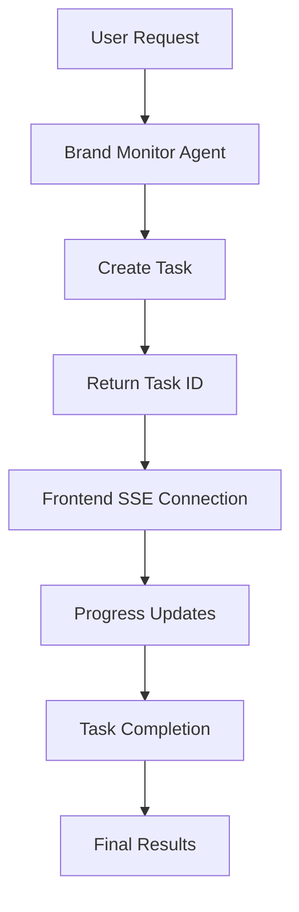

# GEO-205: SSE Infrastructure Setup

## 📋 Ticket Overview

**Type**: Integration Development **Priority**: P1 (Important) **Story Points**:
4  
**Estimated Time**: 6 hours **Assignee**: [Developer Name] **Sprint**: Sprint 2,
Phase 2A  
**Dependencies**: None

## 🎯 User Story

As a **GEO analyst**, I want **real-time progress updates** so that I can
**monitor the status of long-running brand analysis tasks**.

## 📝 Description

Set up Server-Sent Events (SSE) infrastructure to provide real-time progress
updates for long-running brand analysis tasks. This includes creating SSE
endpoints, implementing progress tracking, error reporting, connection
management, and frontend integration for real-time updates.

## 🎨 Acceptance Criteria

### Integration Requirements

- [ ] **AC1**: SSE endpoint for real-time progress updates
- [ ] **AC2**: Progress tracking for each analysis stage
- [ ] **AC3**: Error reporting through SSE
- [ ] **AC4**: Connection management and cleanup
- [ ] **AC5**: Frontend integration with SSE client

### User Experience Requirements

- [ ] **AC6**: User experience remains seamless during long operations
- [ ] **AC7**: Progress updates are informative and accurate
- [ ] **AC8**: Error states provide helpful guidance
- [ ] **AC9**: Connection failures are handled gracefully
- [ ] **AC10**: Real-time updates have minimal latency (<2s)

### Technical Requirements

- [ ] **AC11**: No breaking changes to existing functionality
- [ ] **AC12**: Backward compatibility maintained
- [ ] **AC13**: Performance impact is minimal
- [ ] **AC14**: Security requirements met
- [ ] **AC15**: Graceful handling of connection failures

## 🛠️ Technical Implementation

### Integration Points

```typescript
// app/api/brand-monitor/progress/[taskId]/route.ts
export async function GET(
	request: Request,
	{ params }: { params: { taskId: string } }
) {
	const taskId = params.taskId;

	// Set up SSE headers
	const headers = {
		"Content-Type": "text/event-stream",
		"Cache-Control": "no-cache",
		Connection: "keep-alive",
		"Access-Control-Allow-Origin": "*",
		"Access-Control-Allow-Headers": "Cache-Control",
	};

	const stream = new ReadableStream({
		start(controller) {
			// Send initial connection message
			controller.enqueue(
				`data: ${JSON.stringify({
					type: "connected",
					taskId,
					timestamp: Date.now(),
				})}\n\n`
			);

			// Set up progress tracking
			const progressTracker = new ProgressTracker(taskId, controller);

			// Clean up on connection close
			request.signal.addEventListener("abort", () => {
				progressTracker.cleanup();
			});
		},
	});

	return new Response(stream, { headers });
}

// lib/sse/progress-tracker.ts
export class ProgressTracker {
	private taskId: string;
	private controller: ReadableStreamDefaultController;
	private interval: NodeJS.Timeout | null = null;

	constructor(taskId: string, controller: ReadableStreamDefaultController) {
		this.taskId = taskId;
		this.controller = controller;
		this.startTracking();
	}

	async startTracking() {
		// Check for task progress every 2 seconds
		this.interval = setInterval(async () => {
			try {
				const progress = await this.getTaskProgress(this.taskId);
				this.sendProgress(progress);

				if (progress.status === "completed" || progress.status === "failed") {
					this.cleanup();
				}
			} catch (error) {
				this.sendError(error.message);
				this.cleanup();
			}
		}, 2000);
	}

	sendProgress(progress: TaskProgress) {
		this.controller.enqueue(
			`data: ${JSON.stringify({
				type: "progress",
				taskId: this.taskId,
				progress,
				timestamp: Date.now(),
			})}\n\n`
		);
	}

	sendError(message: string) {
		this.controller.enqueue(
			`data: ${JSON.stringify({
				type: "error",
				taskId: this.taskId,
				message,
				timestamp: Date.now(),
			})}\n\n`
		);
	}

	cleanup() {
		if (this.interval) {
			clearInterval(this.interval);
			this.interval = null;
		}
	}

	private async getTaskProgress(taskId: string): Promise<TaskProgress> {
		// Implementation to get task progress from database/cache
		return await getTaskStatus(taskId);
	}
}
```

### Data Flow



### Frontend Integration

```typescript
// hooks/use-sse-progress.ts
export function useSSEProgress(taskId: string) {
	const [progress, setProgress] = useState<TaskProgress | null>(null);
	const [error, setError] = useState<string | null>(null);
	const [isConnected, setIsConnected] = useState(false);

	useEffect(() => {
		if (!taskId) return;

		const eventSource = new EventSource(
			`/api/brand-monitor/progress/${taskId}`
		);

		eventSource.onopen = () => {
			setIsConnected(true);
		};

		eventSource.onmessage = (event) => {
			const data = JSON.parse(event.data);

			switch (data.type) {
				case "connected":
					console.log("SSE connected for task:", data.taskId);
					break;
				case "progress":
					setProgress(data.progress);
					break;
				case "error":
					setError(data.message);
					break;
			}
		};

		eventSource.onerror = (error) => {
			setError("Connection failed");
			setIsConnected(false);
		};

		return () => {
			eventSource.close();
			setIsConnected(false);
		};
	}, [taskId]);

	return { progress, error, isConnected };
}
```

### Task Status Management

```typescript
// lib/sse/task-manager.ts
export interface TaskProgress {
	taskId: string;
	status: "pending" | "running" | "completed" | "failed";
	stage: string;
	progress: number; // 0-100
	message: string;
	estimatedTimeRemaining?: number;
	results?: any;
	error?: string;
}

export class TaskManager {
	private static tasks = new Map<string, TaskProgress>();

	static createTask(taskId: string): TaskProgress {
		const task: TaskProgress = {
			taskId,
			status: "pending",
			stage: "Initializing",
			progress: 0,
			message: "Task created",
		};

		this.tasks.set(taskId, task);
		return task;
	}

	static updateTask(
		taskId: string,
		updates: Partial<TaskProgress>
	): TaskProgress {
		const task = this.tasks.get(taskId);
		if (!task) {
			throw new Error(`Task ${taskId} not found`);
		}

		const updatedTask = { ...task, ...updates };
		this.tasks.set(taskId, updatedTask);
		return updatedTask;
	}

	static getTask(taskId: string): TaskProgress | undefined {
		return this.tasks.get(taskId);
	}

	static completeTask(taskId: string, results: any): TaskProgress {
		return this.updateTask(taskId, {
			status: "completed",
			stage: "Completed",
			progress: 100,
			message: "Analysis completed successfully",
			results,
		});
	}

	static failTask(taskId: string, error: string): TaskProgress {
		return this.updateTask(taskId, {
			status: "failed",
			stage: "Failed",
			progress: 0,
			message: "Analysis failed",
			error,
		});
	}
}
```

## 🧪 Testing Strategy

### Integration Tests

```typescript
describe("SSE Infrastructure Integration", () => {
	test("should establish SSE connection successfully");
	test("should send progress updates in real-time");
	test("should handle connection failures gracefully");
	test("should maintain performance standards");
	test("should handle errors gracefully");
	test("should clean up connections properly");
});
```

### End-to-End Tests

```typescript
describe("SSE Progress End-to-End", () => {
	test("should work with real brand monitoring workflow");
	test("should handle concurrent connections");
	test("should maintain data integrity");
	test("should provide accurate progress tracking");
});
```

## 🔗 Dependencies

- **Requires**: None
- **External**: None
- **Internal**: Task management system, progress tracking utilities

## 📊 Performance Requirements

- **Connection Time**: < 1 second for SSE connection
- **Update Latency**: < 2 seconds for progress updates
- **Performance Impact**: < 5% degradation on existing functionality
- **Concurrent Usage**: Support 50+ simultaneous SSE connections

## 🔍 Definition of Ready

- [ ] Task management system is designed
- [ ] Progress tracking requirements are defined
- [ ] Frontend integration patterns are established
- [ ] Error handling strategies are planned

## ✅ Definition of Done

- [ ] All acceptance criteria met and verified
- [ ] SSE infrastructure works end-to-end
- [ ] Performance benchmarks met
- [ ] Error handling tested and working
- [ ] Integration tests passing
- [ ] No breaking changes introduced
- [ ] Code review completed and approved
- [ ] Documentation updated

## 🚀 Usage Examples

```typescript
// Example SSE integration usage
const { progress, error, isConnected } = useSSEProgress(taskId);

if (progress) {
	console.log(`Task ${progress.stage}: ${progress.progress}%`);
}
```

## 📝 Notes

- Focus on seamless integration with existing chat interface
- Ensure backward compatibility
- Consider performance implications
- Plan for future extensibility
- Implement proper connection cleanup

## 🔄 Follow-up Tasks

- **GEO-206**: Visibility Scoring Tool
