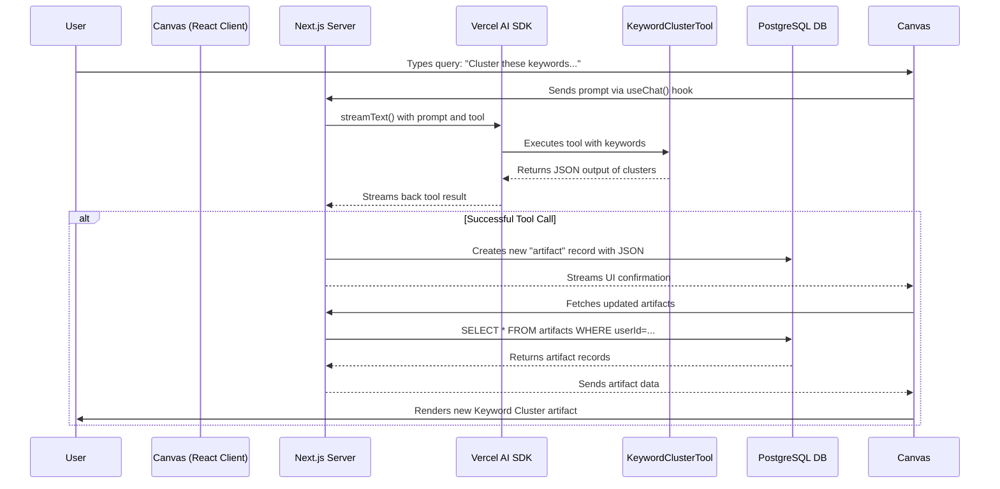

# Technical Docs v2: The Living Dashboard MVP

## 1. Architecture Overview

The MVP architecture is designed for simplicity and leverages our existing stack to prove the core concept of the "Living Dashboard." The primary goal is to establish the flow from a user's chat query to a persistent, rendered artifact on their canvas.

### MVP Data & Control Flow



---

## 2. Core Data Model: The `artifacts` Table

This is the most critical new piece of our database schema. It is the single source of truth for everything displayed on a user's canvas. We will use Drizzle ORM.

### Drizzle Schema: `lib/db/schema.ts`

```typescript
import { pgTable, uuid, varchar, jsonb, timestamp, boolean, integer } from "drizzle-orm/pg-core";
import { users } from "./auth"; // Assuming auth schema exists

export const artifacts = pgTable("artifacts", {
  id: uuid("id").primaryKey().defaultRandom(),
  userId: uuid("user_id").references(() => users.id).notNull(),
  
  // The type of artifact, used by the renderer to choose the correct component
  type: varchar("type", { length: 50 }).notNull(), // e.g., "keyword-cluster-report"
  
  // The JSON data generated by the tool, which the component will use to render
  content: jsonb("content").notNull(),
  
  // Metadata for the canvas
  isPinned: boolean("is_pinned").default(false),
  // Simple ordering for now. Can be replaced with x/y coordinates later.
  displayOrder: integer("display_order").default(0),

  createdAt: timestamp("created_at").defaultNow(),
  updatedAt: timestamp("updated_at").defaultNow(),
});
```

### Key Design Decisions

-   **`content` is JSONB:** This is highly flexible. It allows us to store the unique output of any future tool without changing the database schema. We can query this data directly if needed.
-   **`type` for Rendering:** The frontend will use the `type` field to dynamically select the correct React component to render the `content` data (e.g., `<KeywordClusterReport content={artifact.content} />`).
-   **No `conversations` table for MVP:** To maintain simplicity, we are not saving the chat history itself, only the valuable artifacts that result from it.

---

## 3. Agent-to-Tool Migration: `keywordClusterTool`

We will adapt the existing `keywordClusterTool` from the Mastra project into a standalone, stateless Vercel AI SDK `tool`. This simplifies its execution and makes it easy to integrate with `streamText`.

### Tool Definition: `lib/ai/tools/keyword-cluster-tool.ts`

```typescript
import { tool } from '@ai-sdk/react';
import { z } from 'zod';
import { llmJSONCall } from '../llmJSONCall'; // Re-use existing JSON call logic

// 1. Define Input Schema with Zod
const keywordClusterInput = z.object({
  keywords: z.array(z.string()).describe("A list of keywords to be clustered."),
});

// 2. Define Output Schema with Zod (for structured output)
const keywordClusterOutput = z.object({
  clusters: z.array(
    z.object({
      name: z.string(),
      keywords: z.array(z.string()),
      totalVolume: z.number(),
      avgDifficulty: z.number().optional(),
      aiRelevance: z.number().min(0).max(1),
    })
  ),
});

// 3. Create the Tool
export const keywordClusterTool = tool({
  description: "Groups a list of keywords into semantic clusters for SEO and content strategy.",
  parameters: keywordClusterInput,
  execute: async ({ keywords }) => {
    // The core logic remains the same, calling an LLM to perform the clustering.
    // This logic can be lifted directly from the Mastra implementation.
    const prompt = `You are an SEO & AI strategist. Cluster these keywords into semantic groups: ${keywords.join(", ")}. Respond in JSON matching this schema: ${JSON.stringify(keywordClusterOutput)}`;
    
    try {
      const clusteredData = await llmJSONCall(keywordClusterOutput, prompt);
      return clusteredData;
    } catch (error) {
      console.error("[keywordClusterTool] Failed:", error);
      // Provide a structured error message
      return { error: "Failed to cluster keywords." };
    }
  },
});
```

---

## 4. Core Components & Logic

### a. Chat Server Logic

The Next.js API route handling the chat will be modified to persist the artifact upon a successful tool call.

**File:** `app/api/chat/route.ts`

```typescript
// Simplified for clarity
import { streamText, toolResult } from '@ai-sdk/react';
import { keywordClusterTool } from '@/lib/ai/tools/keyword-cluster-tool';
import { db } from '@/lib/db';
import { artifacts } from '@/lib/db/schema';

export async function POST(req: Request) {
  const { messages } = await req.json();
  const userId = getUserId(); // from auth session

  const result = await streamText({
    model: openai('gpt-4-turbo'),
    messages,
    tools: { keywordClusterTool },
  });

  // After the stream is complete, check for tool results and persist them
  const toolResults = result.toolResults;
  if (toolResults && toolResults.length > 0) {
    for (const res of toolResults) {
      if (res.toolName === 'keywordClusterTool') {
        await db.insert(artifacts).values({
          userId: userId,
          type: 'keyword-cluster-report',
          content: res.result, // The JSON output from the tool
        });
      }
    }
  }

  return result.toAIStreamResponse();
}
```

### b. Artifact Rendering

The frontend will fetch the artifacts and use a mapping to render the correct component for each type.

**File:** `components/universal-canvas.tsx`

```typescript
import { KeywordClusterReport } from './artifacts/keyword-cluster-report';

// Map artifact types to React components
const ARTIFACT_COMPONENTS = {
  'keyword-cluster-report': KeywordClusterReport,
};

export function UniversalCanvas({ userId }) {
  // Fetch artifacts from an API route that queries the database
  const { data: artifacts, isLoading } = useSWR(`/api/artifacts?userId=${userId}`, fetcher);

  if (isLoading) return <p>Loading Canvas...</p>;

  return (
    <div className="canvas-grid">
      {artifacts.map(artifact => {
        const ArtifactComponent = ARTIFACT_COMPONENTS[artifact.type];
        if (!ArtifactComponent) return null;
        
        return <ArtifactComponent key={artifact.id} content={artifact.content} />;
      })}
    </div>
  );
}
```

---

## 5. MVP Technology Stack

-   **Framework:** Next.js 15 (App Router)
-   **AI SDK:** Vercel AI SDK 5.x
-   **Database:** PostgreSQL
-   **ORM:** Drizzle
-   **Authentication:** Better Auth (Existing)
-   **UI:** Tailwind CSS, shadcn/ui (Existing)
