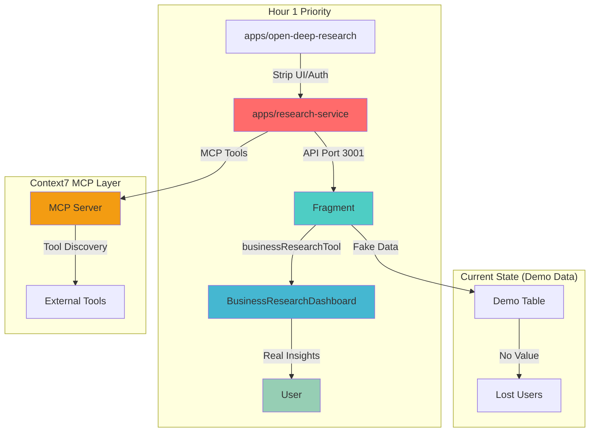
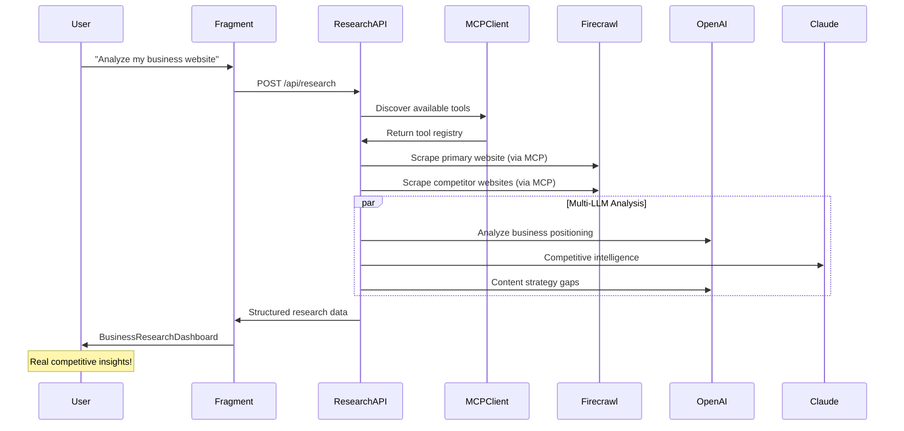
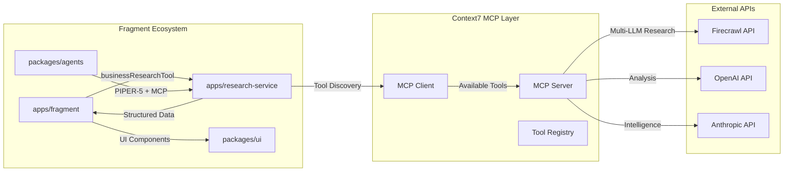
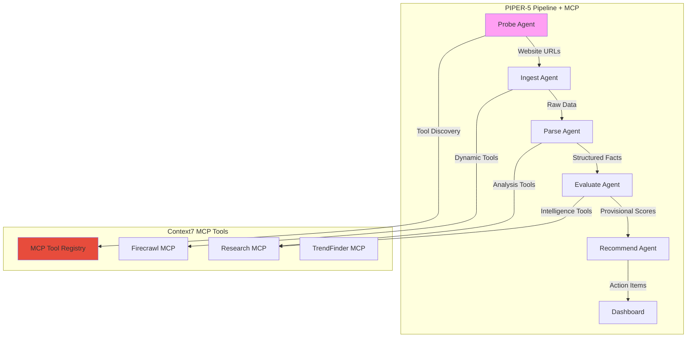

# 🦄 FRAGMENT: TECHNICAL ARCHITECTURE

_Last Updated: 2025-01-19_ _Status: **YC Founder Edition - Ship Value Now**_

---

## 🎯 ARCHITECTURE PHILOSOPHY

**Ship First, Scale Later**: Every technical decision optimizes for customer
value delivery and revenue generation, not theoretical perfection.

**Principle**: Build 80% solutions that work for 1,000 customers rather than
100% solutions that work for 10 customers.

---

## 🏗️ **CURRENT ARCHITECTURE PRIORITY**

### **Hour 1 Foundation: Real Data Pipeline**



**Critical Path**: Convert proven multi-LLM research system → Fragment's primary
data source → User value

**Context7 MCP Integration**: All tools and agents follow Context7 MCP protocol
for composable tool discovery and agent orchestration.

---

## 🎯 **TARGET ARCHITECTURE (Hour 6 End State)**

### **Data Flow: Real Business Intelligence with MCP**



### **Service Architecture with Context7 MCP**



---

## 🔧 **TECHNICAL IMPLEMENTATION**

### **Research Service (apps/research-service)**

**Stripped from `apps/open-deep-research`:**

- ✅ Remove all UI components (auth, chat, themes)
- ✅ Remove database dependencies (no storage needed)
- ✅ Keep core research engine logic
- ✅ Expose as simple API service
- ✅ Add Context7 MCP compatibility layer

**Core API with MCP Integration:**

```typescript
// apps/research-service/app/api/research/route.ts
import { MCPClient } from "@modelcontextprotocol/client";

export async function POST(request: NextRequest) {
	const { website, businessName } = await request.json();

	// Initialize MCP client for tool discovery (Context7 pattern)
	const mcpClient = new MCPClient();
	await mcpClient.connect();

	// Discover available tools dynamically
	const availableTools = await mcpClient.discoverTools([
		"firecrawl.scrape",
		"firecrawl.extract",
		"business.analyze",
	]);

	// Use existing multi-LLM research logic with MCP tools
	const research = await performDeepResearch(
		website,
		businessName,
		availableTools
	);

	return NextResponse.json({
		business: { name: businessName, website },
		findings: {
			competitors: research.competitors,
			marketPosition: research.positioning,
			contentAnalysis: research.content,
			recommendations: research.recommendations,
		},
		metadata: {
			mcp_tools_used: research.toolsUsed,
			context7_compliant: true,
		},
	});
}
```

### **Fragment Integration (apps/fragment)**

**Business Research Tool with Context7 MCP:**

```typescript
// apps/fragment/lib/tools/research-tool.ts
// Reference: Context7 MCP docs for tool schema compliance
export const businessResearchTool = {
	name: "business_research",
	description:
		"Comprehensive business intelligence using Context7 MCP protocol",
	schema: {
		// Context7 MCP schema compliance
		type: "object",
		properties: {
			website: { type: "string", format: "uri" },
			businessName: { type: "string" },
			industry: { type: "string", optional: true },
		},
	},

	execute: async ({ website, businessName, industry }) => {
		const response = await fetch("http://localhost:3001/api/research", {
			method: "POST",
			body: JSON.stringify({ website, businessName, industry }),
		});

		const data = await response.json();
		return {
			type: "business_research_dashboard",
			data, // Passed to BusinessResearchDashboard artifact
			mcp_compliant: data.metadata?.context7_compliant,
		};
	},
};
```

**Dashboard Artifact:**

```typescript
// apps/fragment/components/artifacts/business-research-dashboard.tsx
export function BusinessResearchDashboard({ data }) {
  const { business, findings } = data;

  return (
    <div>
      <h1>{business.name} Analysis</h1>
      <CompetitorChart competitors={findings.competitors} />
      <RecommendationsList recs={findings.recommendations} />
      <MarketPosition position={findings.marketPosition} />

      {/* Context7 MCP indicator */}
      {data.metadata?.context7_compliant && (
        <Badge variant="outline">Context7 MCP Compatible</Badge>
      )}
    </div>
  );
}
```

---

## 🚀 **FUTURE EVOLUTION (Post Hour 6)**

### **PIPER-5 Agent Orchestration with Context7 MCP**

Once we have real data flowing, implement agent pipeline:



### **Context7 MCP Integration Benefits**

**Tool Composability**:

- New services auto-discoverable via MCP
- No hardcoded API integrations
- Dynamic tool capability negotiation

**Agent Flexibility**:

- Agents discover optimal tools at runtime
- Fallback tool strategies
- Tool capability versioning

### 5. Mastra Agent-Driven UI Artifacts (NEW)

**Decision**: `apps/agents-mastra` is the "brain," responsible for generating
structured UI artifacts. `apps/fragment` is the "billboard," responsible solely
for rendering these artifacts. Each UI block will display **only one primary
artifact** at a time.

**Implementation Overview**:

- **Artifact Schemas (agents-mastra)**: Define Zod schemas in
  `apps/agents-mastra/mastra/schemas/artifactSchemas.ts` as the single source of
  truth for artifact structures.
- **Artifact Creator Utility (agents-mastra)**:
  `apps/agents-mastra/lib/artifactCreator.ts` provides a function
  (`createArtifactResponse`) for agents to construct and validate artifact
  payloads against these schemas.
- **Agent Tools (agents-mastra)**: Existing or new agent tools will use
  `createArtifactResponse` to emit structured artifact data (e.g., `data-table`,
  `line-chart`, `action-card`) instead of raw text.
- **Supervisor Agent Streaming (agents-mastra)**: The `supervisorAgent.stream()`
  method in `apps/agents-mastra` will be used with the `output` option set to
  `AgentArtifactResponseSchema` to ensure structured artifact delivery.
- **API Proxy (fragment)**: `apps/fragment/app/api/mastra/chat/route.ts` will
  act as a proxy, forwarding chat requests to `agents-mastra` and streaming back
  mixed content (text and structured `AgentArtifactResponse` objects) as
  Server-Sent Events (SSE) with distinct event types (`event: text`,
  `event: artifact`).
- **Chromeless UI Components (packages/ui)**:
  `packages/ui/src/components/custom/artifacts/` will house generic, chromeless
  React components (`DataTable.tsx`, `LineChart.tsx`, `ActionCard.tsx`,
  `PieChart.tsx`) that directly consume the structured data from `agents-mastra`
  (props typed via imported schemas). These components will use shadcn/ui for
  consistency.
- **Unified Chat Block Rendering (fragment)**:
  `apps/fragment/components/blocks/unified-chat-block.tsx` will be updated to
  intelligently parse the incoming SSE stream. It will detect
  `AgentArtifactResponse` types and dynamically render the corresponding UI
  component, ensuring only one artifact is displayed per message/block to
  prevent clutter.

**Flow Diagram**:

```mermaid
graph TD
    User[User] -->|Chat Prompt| FragmentUI[apps/fragment/components/blocks/UnifiedChatBlock]
    FragmentUI -->|POST /api/mastra/chat| FragmentProxy[apps/fragment/app/api/mastra/chat/route.ts]
    FragmentProxy -->|Calls agent.stream()| AgentsMastra[apps/agents-mastra/mastra/agents/supervisorAgent]
    AgentsMastra -->|Delegates/Uses Tools| AgentTools[apps/agents-mastra/mastra/tools/]
    AgentTools -->|Generates Structured Data| ArtifactCreator[apps/agents-mastra/lib/artifactCreator.ts]
    ArtifactCreator -->|Validates against schemas| ArtifactSchemas[apps/agents-mastra/mastra/schemas/artifactSchemas.ts]
    ArtifactSchemas -->|Returns Validated Artifact| AgentsMastra
    AgentsMastra -->|Streams Text & Object (SSE)| FragmentProxy
    FragmentProxy -->|Streams Mixed Content (SSE)| FragmentUI
    FragmentUI -->|Renders Text or Artifact| UICustomArtifacts[packages/ui/src/components/custom/artifacts/]
    UICustomArtifacts --> User
```

**Customer Value**: This architecture directly supports the customer value
proposition outlined in `PRODUCT_REQUIREMENTS.md` by enabling:

- **GEO Score Card**: Instant, visual summary of AI search visibility.
- **Competitive Analysis Table/Chart**: Clear comparisons with rivals.
- **Actionable Recommendations**: Clear, prioritized next steps with estimated
  impact.

### 6. MCP Integration & Tool Orchestration — **Beyond API Calls** (2025-05)

> **"MCP Tools = Composable Intelligence"**  
> Instead of hardcoding individual API integrations (Firecrawl, Serp, etc.), we
> leverage Model Context Protocol (MCP) clients as **agent tools**. This means
> agents can dynamically discover and use new capabilities without code changes.

#### 6.1 MCP Client Architecture

```typescript
// packages/agents/src/tools/mcp/client.ts
import { MCPClient } from "@modelcontextprotocol/client";

export class MCPToolClient {
	private clients: Map<string, MCPClient> = new Map();

	async connectServer(name: string, config: MCPServerConfig) {
		const client = new MCPClient();
		await client.connect(config);
		this.clients.set(name, client);

		// Auto-discover tools from this server
		const tools = await client.listTools();
		return tools.map((tool) => this.wrapMCPTool(name, tool));
	}

	private wrapMCPTool(serverName: string, mcpTool: MCPTool): AgentTool {
		return {
			name: `${serverName}_${mcpTool.name}`,
			description: mcpTool.description,
			parameters: mcpTool.inputSchema,
			function: async (params) => {
				const client = this.clients.get(serverName);
				return await client.callTool(mcpTool.name, params);
			},
		};
	}
}
```

#### 6.2 Open-Deep-Research as Internal API Service

**Problem**: We need deep research capabilities but don't want to rebuild from
scratch.  
**Solution**: Extract `apps/open-deep-research` into a standalone
**research-api** service.

```typescript
// apps/research-api/src/server.ts (Simplified ODR)
import express from "express";
import { deepResearchTool } from "./tools/deep-research";

const app = express();

app.post("/api/research", async (req, res) => {
	const { topic, maxDepth = 5, sources = [] } = req.body;

	// Reuse ODR's deepResearch logic without UI/auth
	const results = await deepResearchTool.execute({
		topic,
		maxDepth,
		sources,
		// Use our Firecrawl key, not user's
		firecrawlApiKey: process.env.FIRECRAWL_API_KEY,
	});

	res.json({
		success: true,
		data: {
			findings: results.findings,
			analysis: results.analysis,
			sources: results.sources,
			depth_reached: results.currentDepth,
		},
	});
});
```

**Agent Integration**:

```typescript
// packages/agents/src/tools/research/deep-research-tool.ts
export class DeepResearchTool implements AgentTool {
	name = "deep_research";
	description = "Perform comprehensive multi-source research on a topic";

	async function(params: { topic: string; focus?: string }) {
		const response = await fetch(
			`${process.env.RESEARCH_API_URL}/api/research`,
			{
				method: "POST",
				headers: { "Content-Type": "application/json" },
				body: JSON.stringify({
					topic: params.topic,
					maxDepth: 3, // Faster for real-time agent use
					focus: params.focus || "business_visibility",
				}),
			}
		);

		const result = await response.json();

		// Return formatted facts for PIPER-5 ingestion
		return {
			type: "research_facts",
			facts: result.data.findings.map((f) => ({
				type: "mention" | "insight" | "competitor",
				content: f.text,
				source: f.source,
				confidence: 0.8,
			})),
			summary: result.data.analysis,
		};
	}
}
```

#### 6.3 Trend Detection Integration (Post-MVP)

**TrendFinder Integration**: Similar pattern for social/trend monitoring.

```typescript
// apps/trend-api/src/server.ts (Simplified TrendFinder)
app.post("/api/trends/detect", async (req, res) => {
	const { topics, timeframe = "24h" } = req.body;

	const trends = await trendDetector.analyze({
		keywords: topics,
		platforms: ["twitter", "reddit"],
		timeframe,
	});

	res.json({
		trends: trends.map((t) => ({
			topic: t.topic,
			momentum: t.score,
			sources: t.mentions,
			sentiment: t.sentiment,
		})),
	});
});
```

#### 6.4 MCP Server Ecosystem

**Target MCP Servers for Fragment**:

- **firecrawl-mcp**: Search, extract, scrape (replaces direct API calls)
- **social-mcp**: Twitter, Reddit monitoring
- **analytics-mcp**: GA4, Search Console data
- **ai-mcp**: Multi-LLM prompt execution

**Discovery & Auto-Configuration**:

```typescript
// packages/agents/src/mcp/discovery.ts
export class MCPDiscovery {
	async discoverAndConnect() {
		const servers = [
			{ name: "firecrawl", url: "http://localhost:3001/mcp" },
			{ name: "research", url: "http://localhost:3002/mcp" },
			{ name: "trends", url: "http://localhost:3003/mcp" },
		];

		const tools: AgentTool[] = [];
		for (const server of servers) {
			try {
				const serverTools = await this.mcpClient.connectServer(
					server.name,
					server
				);
				tools.push(...serverTools);
			} catch (error) {
				console.warn(`MCP Server ${server.name} unavailable:`, error.message);
			}
		}

		return tools;
	}
}
```

#### 6.5 Why This Architecture Wins

**vs. Direct API Integration**:

- ✅ **Composable**: New tools plug in without code changes
- ✅ **Resilient**: Failed MCP servers don't break core agents
- ✅ **Testable**: Mock MCP servers for development
- ✅ **Scalable**: Heavy research runs in dedicated services

**vs. Monolithic Agents**:

- ✅ **Modular**: Research logic isolated in research-api
- ✅ **Reusable**: Other apps can use research-api directly
- ✅ **Performance**: Parallel execution across services

**Implementation Priority**:

1. **FRAG-031**: Research-API extraction (Week 9)
2. **FRAG-032**: MCP Client + Firecrawl MCP (Week 10)
3. **FRAG-033**: Trend-API integration (Post-MVP)

### 7. Research-API & TrendFinder Integration — **Composable AI Services** (2025-05)

> **"Don't rebuild — extract and compose."**  
> Rather than coding Firecrawl integrations from scratch, we extract proven
> capabilities from open-source projects and compose them as API services.

#### 7.1 Research-API Service (Next.js API Routes)

```typescript
// apps/research-api/app/api/research/route.ts
// Simplified from: apps/open-deep-research

import { NextRequest, NextResponse } from "next/server";
import { deepResearchService } from "@/lib/services/deep-research";

export async function POST(request: NextRequest) {
	try {
		const { topic, maxDepth = 3, focus } = await request.json();

		if (!topic) {
			return NextResponse.json(
				{ success: false, error: "Topic is required" },
				{ status: 400 }
			);
		}

		// Uses existing deep-research logic but simplified:
		// 1. No auth/user management (stripped out)
		// 2. No database persistence (removed)
		// 3. Structured JSON response for agent consumption
		const results = await deepResearchService.execute({
			topic,
			maxDepth: Math.min(maxDepth, 5),
			focus: focus || "business_analysis",
		});

		return NextResponse.json({
			success: true,
			data: {
				findings: results.findings, // Array of research facts
				analysis: results.analysis, // LLM summary
				sources: results.sources, // Source URLs + metadata
				execution_time_ms: results.executionTime,
			},
		});
	} catch (error) {
		console.error("Research API error:", error);
		return NextResponse.json(
			{ success: false, error: "Research failed" },
			{ status: 500 }
		);
	}
}

// Health check endpoint
export async function GET() {
	return NextResponse.json({
		status: "ok",
		service: "research-api",
		version: "1.0.0",
	});
}
```

**Agent Integration**: `DeepResearchTool` calls this API and formats results as
`research_finding` facts for PIPER-5 ingestion.

#### 7.2 TrendFinder Service (TBD - Next.js API Routes)

```typescript
// apps/trends-api/app/api/trends/scan/route.ts
// TBD: Extract from https://github.com/iankiku/trendFinder

import { NextRequest, NextResponse } from "next/server";
// import { trendDetector } from '@/lib/services/trend-detector';

export async function POST(request: NextRequest) {
	try {
		const { industry, keywords, influencers } = await request.json();

		// TBD: Simplified trend detection logic to be extracted:
		// 1. Monitor Twitter/X influencers (rate-limited)
		// 2. Scrape competitor websites for changes
		// 3. Analyze Reddit discussions

		// Placeholder response structure
		return NextResponse.json({
			success: true,
			data: {
				trends: [], // Array of trend objects
				sentiment: 0.5, // Overall sentiment score
				alerts: [], // High-impact changes
				sources: [], // Where trends were detected
			},
		});
	} catch (error) {
		console.error("Trends API error:", error);
		return NextResponse.json(
			{ success: false, error: "Trend analysis failed" },
			{ status: 500 }
		);
	}
}
```

**Value**: "Fragment doesn't just diagnose invisibility — it shows exactly what
competitors are doing to stay visible and alerts you to new opportunities."

#### 7.3 Service Architecture Benefits

1. **Speed**: Extract proven logic instead of rebuilding from scratch
2. **Isolation**: Each service fails independently
3. **Scaling**: Research-API can run on bigger instances for heavy analysis
4. **Composability**: New services integrate via MCP without Fragment code
   changes
5. **Testing**: Services can be tested independently of main Fragment app

> **Deployment Pattern**: Each service runs as separate container/function.  
> **Discovery**: MCP client auto-discovers available services and their tools.  
> **Error Handling**: Agents gracefully degrade when services are unavailable.

---

## 🏗️ IMPLEMENTATION LAYERS

### Layer 1: User Experience (Revenue Critical)

**UnifiedChatBlock Component**

```typescript
// apps/fragment/components/blocks/unified-chat-block.tsx
export function UnifiedChatBlock({ onArtifactGenerated }: Props) {
  const { messages, append } = useChat({ api: '/api/chat' })
  const [mode, setMode] = useState<'idle' | 'chatting' | 'artifact_view'>('idle')

  // State machine: idle → chatting → artifact_view
  useEffect(() => {
    const hasToolResult = messages.some(m =>
      m.toolInvocations?.some(t => 'result' in t)
    )
    if (hasToolResult) setMode('artifact_view')
  }, [messages])

  return (
    <div className="h-full flex flex-col">
      {/* Artifact layer (base) */}
      {mode === 'artifact_view' && <ArtifactRenderer messages={messages} />}

      {/* Chat overlay */}
      {mode === 'chatting' && <ChatOverlay messages={messages} />}

      {/* Always-visible input */}
      <ChatInput onSubmit={append} onFocus={() => setMode('chatting')} />
    </div>
  )
}
```

**Artifact Registry (Simple Version)**

```typescript
// lib/artifact-registry.ts
const ARTIFACT_REGISTRY = {
  geo_score: GeoScoreCard,
  recommendations: RecommendationsCard,
  trend_chart: TrendChart, // Phase 2
  competitor_matrix: CompetitorMatrix // Phase 2
}

export function renderArtifact(toolName: string, data: any) {
  const Component = ARTIFACT_REGISTRY[toolName]
  return Component ? <Component data={data} /> : null
}
```

### Layer 2: Intelligence API (Core Value)

**GEO Scanning Engine**

```typescript
// apps/fragment/app/api/geo-scan/route.ts
export async function POST(req: Request) {
	const { businessName, industry } = await req.json();

	// Generate industry-specific queries
	const queries = [
		`best ${industry} software 2024`,
		`${industry} tools comparison`,
		`how to choose ${industry} solution`,
		`${businessName} alternatives`,
		`${businessName} vs competitors`,
	];

	// Parallel LLM scanning for speed
	const [chatgptResults, claudeResults, perplexityResults] = await Promise.all([
		scanChatGPT(queries, businessName),
		scanClaude(queries, businessName),
		scanPerplexity(queries, businessName),
	]);

	// Calculate unified GEO score
	const geoScore = calculateGeoScore({
		chatgpt: chatgptResults,
		claude: claudeResults,
		perplexity: perplexityResults,
	});

	return Response.json({
		geoScore: geoScore.overall,
		platformBreakdown: geoScore.byPlatform,
		competitorAnalysis: await analyzeCompetitors(industry, geoScore),
		recommendations: await generateRecommendations(geoScore, industry),
	});
}
```

**LLM Query Implementation**

```typescript
// lib/llm-scanners.ts
async function scanChatGPT(queries: string[], targetBusiness: string) {
	const results = [];

	for (const query of queries) {
		const response = await openai.chat.completions.create({
			model: "gpt-4",
			messages: [
				{
					role: "user",
					content: `${query}\n\nPlease provide a comprehensive answer including specific tool recommendations.`,
				},
			],
			temperature: 0.1, // Consistent results
		});

		const mentions = extractBusinessMentions(
			response.choices[0].message.content,
			targetBusiness
		);
		results.push({
			query,
			mentions,
			ranking: calculateMentionRanking(mentions, targetBusiness),
			context: extractMentionContext(
				response.choices[0].message.content,
				targetBusiness
			),
		});
	}

	return results;
}
```

### Layer 3: Scoring & Intelligence

**GEO Scoring Algorithm**

```typescript
// lib/geo-scoring.ts
interface GeoScore {
	overall: number; // 0-10
	breakdown: {
		mentionFrequency: number; // 40% weight
		rankingPosition: number; // 30% weight
		contextRelevance: number; // 20% weight
		sentimentScore: number; // 10% weight
	};
	platformScores: {
		chatgpt: number;
		claude: number;
		perplexity: number;
	};
}

export function calculateGeoScore(scanResults: MultiLLMResults): GeoScore {
	const scores = Object.entries(scanResults).map(([platform, results]) => {
		const mentionFreq =
			results.filter((r) => r.mentions.length > 0).length / results.length;
		const avgPosition =
			results.reduce((acc, r) => acc + r.ranking, 0) / results.length;
		const avgRelevance =
			results.reduce((acc, r) => acc + r.context.relevance, 0) / results.length;
		const avgSentiment =
			results.reduce((acc, r) => acc + r.context.sentiment, 0) / results.length;

		return {
			platform,
			score:
				mentionFreq * 4 + avgPosition * 3 + avgRelevance * 2 + avgSentiment * 1,
		};
	});

	const overall = scores.reduce((acc, s) => acc + s.score, 0) / scores.length;

	return {
		overall,
		breakdown: calculateBreakdown(scanResults),
		platformScores: scores.reduce(
			(acc, s) => ({ ...acc, [s.platform]: s.score }),
			{}
		),
	};
}
```

---

## 🚀 SHIPPING TIMELINE & ARCHITECTURE EVOLUTION

### Week 1: Core GEO Engine (FRAG-007)

```typescript
// Minimal viable architecture
API Routes: /api/geo-scan
Components: GeoScoreCard
Data: In-memory processing
Auth: None (trial mode)
Persistence: localStorage
```

### Week 2: Revenue Activation (FRAG-008)

```typescript
// Add monetization layer
API Routes: +/api/geo-recommendations, +/api/stripe/checkout
Components: +RecommendationsCard, +UsageLimitBanner
Data: localStorage + Stripe
Auth: Simple email collection
Persistence: localStorage + payment records
```

### Week 3-4: Scale Foundation (FRAG-002, FRAG-001)

```typescript
// Add architecture for growth
API Routes: +/api/ollama/chat
Components: Artifact Registry system
Data: Supabase migration
Auth: Supabase Auth
Persistence: Full database schema
```

### Week 5-6: Market Expansion (FRAG-003, FRAG-004)

```typescript
// Advanced features
API Routes: +/api/trends, +/api/exports
Components: +TrendChart, +CompetitorMatrix
Data: Advanced analytics
Auth: Team workspaces
Persistence: Multi-tenant data
```

---

## 🔧 SCALABILITY STRATEGY

### Performance Optimization (Revenue-First)

**API Response Times**

- Target: <2s for initial GEO scan, <5s for complete analysis
- Strategy: Parallel LLM calls, aggressive caching, progressive loading
- Monitoring: Vercel Analytics + custom metrics

**Concurrent User Support**

- Target: 100+ simultaneous GEO scans
- Strategy: Serverless edge functions, rate limiting, queue management
- Monitoring: Real-time dashboard of API performance

**Cost Management**

- Target: <$5 COGS per customer per month
- Strategy: Intelligent query batching, result caching, local AI fallback
- Monitoring: LLM API cost tracking per customer

### Data Architecture Evolution

**Phase 1 (MVP)**: localStorage + API calls

```typescript
// Simple and fast for MVP
const geoHistory = JSON.parse(localStorage.getItem("geo-history") || "[]");
```

**Phase 2 (Scale)**: Supabase + caching

```typescript
// Professional data management
const { data } = await supabase
	.from("geo_scans")
	.select("*")
	.eq("business_name", businessName)
	.order("created_at", { ascending: false });
```

**Phase 3 (Enterprise)**: Multi-tenant + analytics

```typescript
// Enterprise-ready architecture
const analytics = await prisma.geoScan.aggregate({
	where: { organizationId },
	_avg: { geoScore: true },
	_count: { id: true },
});
```

---

## 🚨 RISK MITIGATION

### Technical Risks & Solutions

**API Dependencies**

- Risk: OpenAI/Claude/Perplexity rate limits or outages
- Solution: Multiple provider fallbacks, intelligent retry logic, graceful
  degradation

**Response Quality**

- Risk: Inconsistent or inaccurate GEO scores
- Solution: Multi-query validation, manual verification pipeline, customer
  feedback loops

**Performance Under Load**

- Risk: Slow response times with multiple users
- Solution: Caching strategy, edge computing, background processing

### Business Architecture Risks

**Customer Expectations**

- Risk: Overselling capabilities in beta phase
- Solution: Clear communication, iterative improvements, customer success focus

**Competitive Response**

- Risk: Large players copying the approach
- Solution: Execution speed, customer relationships, continuous innovation

---

## 📊 ARCHITECTURE METRICS

### Technical KPIs (Weekly Review)

- **API Response Time**: P50 <2s, P95 <5s
- **Error Rate**: <2% across all endpoints
- **Uptime**: >99.5% availability
- **Cost Per Customer**: <$5 COGS per month

### Business KPIs (Daily Review)

- **Revenue per Architecture Investment**: ROI on tech decisions
- **Customer Success**: Features driving retention and expansion
- **Time to Value**: Seconds from question to actionable insight

---

## 🎯 NEXT ARCHITECTURAL DECISIONS

### Immediate (This Week)

1. **Multi-LLM Provider Strategy**: Implement with fallbacks
2. **Error Handling**: User-friendly error states and recovery
3. **Performance Monitoring**: Real-time dashboards

### Short-term (Next Month)

1. **Database Migration**: localStorage → Supabase
2. **Authentication**: Secure user accounts and data
3. **Artifact Registry**: Scalable component system

### Medium-term (Next Quarter)

1. **Local AI Integration**: Ollama for enterprise customers
2. **Advanced Analytics**: Trend analysis and forecasting
3. **API Platform**: External integrations and partnerships

---

**Architecture Status**: 🚧 **SHIPPING MODE - VALUE FIRST** **Philosophy**:
Perfect is the enemy of shipped. Customer success validates architecture
decisions. **Review Cadence**: Weekly architecture reviews focused on customer
impact and revenue metrics
