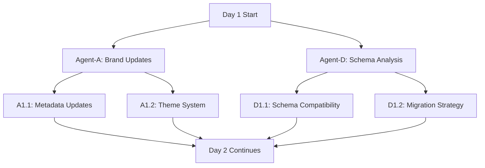

# Dependency Coordination Strategy - GEO Dashboard Transformation

## Executive Summary

This document outlines the comprehensive strategy for managing dependencies, coordinating handoffs, and optimizing parallel execution during the ai-chatbot to GEO dashboard transformation. The strategy ensures maximum parallel work while maintaining quality and minimizing blocking dependencies.

## Dependency Analysis Framework

### Dependency Classification System

#### **Type 1: Critical Path Dependencies (Hard Dependencies)**
- **Definition:** Cannot proceed without completion of prerequisite
- **Impact:** Direct blocking of subsequent work
- **Management:** Priority coordination and buffer time allocation
- **Examples:** Database schema alignment before auth integration

#### **Type 2: Integration Dependencies (Soft Dependencies)**  
- **Definition:** Can proceed with mock/placeholder data
- **Impact:** Integration effort required but parallel development possible
- **Management:** Mock data strategies and integration windows
- **Examples:** UI components can use mock data while APIs are developed

#### **Type 3: Information Dependencies (Knowledge Dependencies)**
- **Definition:** Requires specifications or decisions but not completion
- **Impact:** Planning and design decisions
- **Management:** Early specification sharing and decision documentation
- **Examples:** API interfaces needed for TypeScript types

## Critical Path Analysis

### Primary Critical Path (8 days)
```
Day 1: Database Schema Analysis (D1.1)
  ↓
Day 2: Database Integration Layer (D2.1) 
  ↓
Day 3: Auth Integration Start (B3.1) ← CRITICAL DEPENDENCY
  ↓
Day 4: Auth Integration Complete (B4.2)
  ↓
Day 7: System Integration Testing (I7.1)
  ↓
Day 8: Production Readiness (I8.2)
```

### Secondary Paths (Parallel Execution)
```
Path A (Frontend): A1.1 → A2.2 → A5.1 → A6.2 → I7.1
Path C (AI Tools): C3.1 → C4.1 → C5.2 → I7.1  
Path D (Database): D1.1 → D2.1 → Support Mode → I7.1
```

## Detailed Dependency Mapping

### Phase 1 Dependencies (Days 1-2)

#### **No Critical Dependencies**
- **Agent-A (Frontend):** Can start immediately with brand transformation
- **Agent-D (Database):** Can start immediately with schema analysis
- **Parallel Execution:** 100% parallel work possible



### Phase 2 Dependencies (Days 3-4)

#### **Critical Dependency Chain**
- **D2.1 (Database Integration)** → **B3.1 (Auth Integration Start)**
- **Blocker Risk:** High if database integration delayed
- **Mitigation:** Mock authentication layer for parallel development

```yaml
Day_3_Dependencies:
  Agent_B_Start:
    Depends_On: [D2.1_Database_Integration]
    Blocker_Risk: High
    Mitigation: 
      - Mock auth layer for development
      - Parallel NextAuth removal
      
  Agent_C_Start:
    Depends_On: [None_Immediate]
    Parallel_Opportunity: 100%
    Mock_Strategy: Use placeholder API responses
```

#### **Soft Dependencies**
- **Agent-C:** Can start with mock data while database finalizes
- **Agent-A:** Continues with component development independent of auth

### Phase 3 Dependencies (Days 5-7)

#### **Integration Dependencies**
- **Multiple Agent Coordination Required**
- **Critical Integration Points:** C4.2 ↔ A6.2, B5.1 ↔ D2.1

```yaml
Integration_Points:
  Artifact_System:
    Agents: [C, A]
    Dependency: C4.1_Artifacts → A6.2_Chat_Interface
    Coordination: Daily sync on artifact specs
    
  Auth_Database:
    Agents: [B, D]  
    Dependency: D2.1_Schema → B5.1_Auth_Testing
    Coordination: Shared test database instance
    
  System_Integration:
    Agents: [A, B, C, D]
    Dependency: All major components → I7.1_Integration
    Coordination: Integration testing phase
```

## Parallel Execution Optimization

### Parallelization Matrix

| Day | Agent-A | Agent-B | Agent-C | Agent-D | Parallel % |
|-----|---------|---------|---------|---------|------------|
| **1** | A1.1, A1.2 | - | - | D1.1, D1.2 | 100% |
| **2** | A2.1, A2.2 | - | - | D2.1 | 100% |
| **3** | A3.1 | B3.1, B3.2 | C3.1, C3.2 | D3.1 | 90% |
| **4** | A4.1 | B4.1, B4.2 | C4.1, C4.2 | D4.1 | 85% |
| **5** | A5.1, A5.2 | B5.1 | C5.1, C5.2 | D5.1 | 95% |
| **6** | A6.1, A6.2 | B6.1, B6.2 | C6.1 | D6.1 | 90% |
| **7** | Integration | Integration | Integration | Integration | 75% |
| **8** | Testing | Testing | Testing | Testing | 80% |

### Coordination Strategies by Phase

#### **Phase 1: Maximum Parallelization**
```yaml
Strategy: Independent_Parallel_Execution
Coordination_Needs: Minimal
Daily_Sync: 10 minutes status update
Dependencies: None critical
Risk_Level: Low
```

#### **Phase 2: Managed Dependencies**  
```yaml
Strategy: Coordinated_Parallel_With_Handoffs
Coordination_Needs: Medium
Daily_Sync: 15 minutes with dependency review
Dependencies: D2.1 → B3.1 (Critical)
Risk_Level: Medium
Mitigation: Mock systems for parallel work
```

#### **Phase 3: Integration Coordination**
```yaml
Strategy: Synchronized_Integration_Development  
Coordination_Needs: High
Daily_Sync: 20 minutes with integration planning
Dependencies: Multiple soft dependencies
Risk_Level: Medium-High
Mitigation: Integration testing environment
```

## Handoff Management Protocol

### Handoff Quality Standards

#### **Code Handoffs**
```yaml
Requirements:
  - Unit tests passing (100%)
  - Integration tests written
  - Code review completed
  - Documentation updated
  - Performance benchmarks met
  
Acceptance_Criteria:
  - Functionality validated
  - No breaking changes
  - Backward compatibility maintained
  - Error handling implemented
```

#### **Specification Handoffs**
```yaml
Requirements:
  - API specifications documented
  - TypeScript interfaces defined
  - Mock data examples provided
  - Integration test cases written
  
Acceptance_Criteria:
  - Specs validated by receiving agent
  - Mock implementations available
  - Test scenarios documented
  - Performance requirements defined
```

### Critical Handoff Points

#### **Handoff 1: Database → Authentication**
```yaml
From: Agent-D (Database Integration)
To: Agent-B (Authentication Integration)
Trigger: D2.1 completion
Deliverables:
  - Database adapter functions
  - User schema compatibility layer
  - Connection testing validation
  - TypeScript type definitions
  
Timeline: End of Day 2
Buffer: 4 hours
Fallback: Mock authentication layer
```

#### **Handoff 2: AI Tools → Frontend**
```yaml
From: Agent-C (AI Tools)
To: Agent-A (Frontend)
Trigger: C4.1 completion
Deliverables:
  - Artifact component specifications
  - Mock data structures
  - API response formats
  - Chart data requirements
  
Timeline: End of Day 4
Buffer: 2 hours
Fallback: Static mock components
```

#### **Handoff 3: All Agents → Integration**
```yaml
From: All Agents
To: Integration Phase
Trigger: Core functionality completion
Deliverables:
  - All components functional
  - Individual testing complete
  - Documentation updated
  - Performance validated
  
Timeline: End of Day 6
Buffer: 8 hours
Fallback: Phased integration approach
```

## Risk Mitigation Strategies

### Dependency Risk Matrix

| Risk | Probability | Impact | Mitigation Strategy |
|------|-------------|---------|-------------------|
| **Database Integration Delay** | 25% | High | Mock adapter + parallel auth development |
| **Auth Integration Complexity** | 30% | High | Better Auth expertise + staging environment |
| **Artifact Integration Issues** | 20% | Medium | Mock components + iterative integration |
| **Performance Bottlenecks** | 15% | Medium | Performance monitoring + optimization buffer |
| **Communication Breakdown** | 10% | High | Structured protocols + daily coordination |

### Mitigation Implementation

#### **Mock Development Strategy**
```yaml
Database_Mocks:
  - Mock user data for auth testing
  - Mock conversation data for chat testing  
  - Mock company data for GEO tools
  
Authentication_Mocks:
  - Mock session management
  - Mock user roles and permissions
  - Mock auth state for component development
  
API_Mocks:
  - Mock GEO analysis responses
  - Mock chart data for artifacts
  - Mock error states for testing
```

#### **Parallel Development Protocols**
```yaml
Branch_Strategy:
  - Feature branches for each agent
  - Integration branch for handoffs
  - Main branch protection
  
Testing_Strategy:
  - Unit tests for individual components
  - Integration tests for handoffs
  - End-to-end tests for user flows
  
Review_Strategy:
  - Code reviews before handoffs
  - Architecture reviews for major changes
  - Performance reviews for optimization
```

## Coordination Communication Framework

### Daily Coordination Meetings

#### **Morning Standup (9:00 AM, 15 minutes)**
```yaml
Agenda:
  1. Progress Updates (2 min per agent)
     - Completed tasks
     - Current focus
     - Blockers identified
     
  2. Dependency Review (5 minutes)
     - Critical path status
     - Handoff readiness
     - Integration timeline
     
  3. Risk Assessment (3 minutes)
     - New risks identified
     - Mitigation effectiveness
     - Timeline adjustments needed
```

#### **Mid-Day Sync (1:00 PM, 10 minutes)**
```yaml
Participants: Agents with active handoffs only
Focus: 
  - Handoff preparation status
  - Integration point coordination
  - Immediate blocker resolution
```

#### **End-of-Day Review (5:00 PM, 10 minutes)**
```yaml
Participants: All agents + coordinator
Focus:
  - Day completion status
  - Next day preparation
  - Dependency chain validation
```

### Asynchronous Communication

#### **Slack Channels**
```yaml
#geo-dashboard-general: Overall project updates
#geo-dashboard-frontend: Agent-A specific discussions
#geo-dashboard-auth: Agent-B specific discussions  
#geo-dashboard-ai: Agent-C specific discussions
#geo-dashboard-database: Agent-D specific discussions
#geo-dashboard-integration: Cross-agent coordination
```

#### **Documentation Updates**
```yaml
Daily_Updates:
  - Progress tracking in project board
  - Blocker documentation in issues
  - Handoff status in coordination doc
  
Weekly_Updates:
  - Architecture decision records
  - Performance metrics review
  - Risk assessment updates
```

## Integration Testing Strategy

### Continuous Integration Approach

#### **Individual Agent Testing**
```yaml
Unit_Testing:
  - Component-level tests
  - Function-level tests
  - Mock integration tests
  
Performance_Testing:
  - Component rendering performance
  - API response time testing
  - Database query performance
```

#### **Cross-Agent Integration Testing**
```yaml
Integration_Points:
  - Frontend ↔ AI Tools artifact rendering
  - Authentication ↔ Database user management
  - All components ↔ System integration
  
Testing_Environment:
  - Dedicated integration branch
  - Shared staging database
  - Mock external services
```

#### **End-to-End Testing**
```yaml
User_Flows:
  - Login → Chat → GEO Analysis → Results
  - Registration → Setup → First Analysis
  - Error handling → Recovery → Success
  
Validation_Criteria:
  - All features functional
  - Performance requirements met
  - Security requirements validated
```

## Success Metrics and KPIs

### Coordination Effectiveness Metrics

#### **Dependency Management**
- **Handoff Success Rate:** Target 100% on-time handoffs
- **Dependency Blocking Time:** Target <4 hours average
- **Parallel Work Percentage:** Target 85% of total effort
- **Critical Path Adherence:** Target 100% milestone completion

#### **Communication Effectiveness**
- **Daily Standup Participation:** Target 100%
- **Issue Resolution Time:** Target <2 hours for blockers
- **Documentation Currency:** Target 100% up-to-date
- **Agent Satisfaction:** Target 4.5/5.0 coordination rating

#### **Quality Maintenance**
- **Code Review Coverage:** Target 100% before handoffs
- **Test Coverage:** Target 90% unit test coverage
- **Integration Success Rate:** Target 95% first-pass integration
- **Performance Regression:** Target 0% performance degradation

### Timeline Adherence Tracking

#### **Phase Completion Metrics**
```yaml
Phase_1: Days 1-2
  - Target: 100% completion by end Day 2
  - Buffer: 4 hours
  - Success Criteria: Foundation components ready
  
Phase_2: Days 3-4  
  - Target: 100% completion by end Day 4
  - Buffer: 6 hours
  - Success Criteria: Core integration complete
  
Phase_3: Days 5-7
  - Target: 100% completion by end Day 7
  - Buffer: 8 hours
  - Success Criteria: Full functionality operational
```

## Contingency Planning

### Escalation Procedures

#### **Level 1: Agent Self-Resolution** 
- **Timeline:** 0-2 hours
- **Scope:** Individual task blockers
- **Process:** Agent attempts resolution with available resources

#### **Level 2: Peer Collaboration**
- **Timeline:** 2-4 hours  
- **Scope:** Cross-agent dependencies
- **Process:** Affected agents collaborate on solution

#### **Level 3: Coordinator Intervention**
- **Timeline:** 4-8 hours
- **Scope:** Critical path threats
- **Process:** Coordinator facilitates resolution and timeline adjustment

#### **Level 4: Scope Adjustment**
- **Timeline:** 8+ hours
- **Scope:** Major blocker requiring scope change
- **Process:** Stakeholder consultation and requirement adjustment

### Fallback Strategies

#### **Database Integration Failure**
```yaml
Fallback: Maintain separate ai-chatbot database temporarily
Impact: Delayed full integration but functional system
Timeline: +2 days for later integration
Risk: Duplicate data management
```

#### **Authentication Integration Failure**
```yaml
Fallback: Enhanced NextAuth configuration as interim solution  
Impact: Delayed Better Auth integration
Timeline: +1 day for auth system alignment
Risk: Additional maintenance overhead
```

#### **AI Tools Development Delay**
```yaml
Fallback: Basic tools with expanded functionality later
Impact: Reduced initial feature set
Timeline: Maintain original timeline with phased rollout
Risk: User experience expectations
```

This dependency coordination strategy ensures efficient parallel execution while maintaining quality and minimizing risks through proactive planning and clear communication protocols.